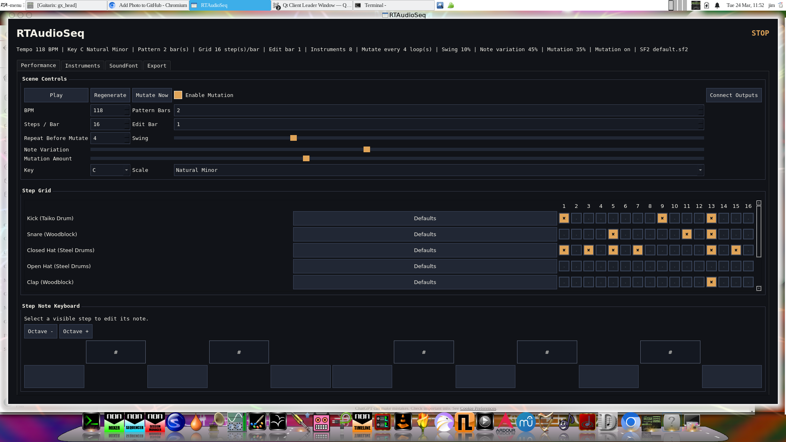

# RTAudioSeq (RTAudioLinux)

`RTAudioSeq` is a Linux-native generative soundfont sequencer built with `Qt5 Widgets`, `JACK`, `FluidSynth`, and plain C++17.

## What it does

- Variable-length step sequencer with dynamic instruments
- SF2, sample, and MIDI instrument routing
- Swing, tempo, mutation depth, and auto-mutation bar count
- Live regeneration and pattern mutation
- JACK audio output and offline WAV export

## Layout

- `src/app`: application orchestration
- `src/audio`: JACK transport and render loop
- `src/core`: shared musical data structures
- `src/generation`: pattern generation and mutation rules
- `src/ui`: Qt widgets and layout
- `tests`: non-UI verification

## Build

```bash
mkdir build && cd build
cmake ..
```

## Run

Start JACK or PipeWire's JACK shim first, then launch:

```bash
./RTAudioSeq
```

## App Preview




This is a LDD output of the built binary to give some idea of the full dependancies ; 


	libQt5Widgets.so.5 => /opt/qt5/lib/libQt5Widgets.so.5 (0x00007f180543a000)
	libQt5Multimedia.so.5 => /opt/qt5/lib/libQt5Multimedia.so.5 (0x00007f1805331000)
	libQt5Gui.so.5 => /opt/qt5/lib/libQt5Gui.so.5 (0x00007f1804ccf000)
	libQt5Network.so.5 => /opt/qt5/lib/libQt5Network.so.5 (0x00007f1804b55000)
	libQt5Core.so.5 => /opt/qt5/lib/libQt5Core.so.5 (0x00007f18045d2000)
	libjack.so.0 => /usr/lib/libjack.so.0 (0x00007f1804579000)
	libsndfile.so.1 => /usr/lib/libsndfile.so.1 (0x00007f18044da000)
	libfluidsynth.so.2 => /usr/lib/libfluidsynth.so.2 (0x00007f1804405000)
	libpthread.so.0 => /lib/libpthread.so.0 (0x00007f1804384000)
	libstdc++.so.6 => /opt/gcc-rtaudio-linux/lib/libstdc++.so.6 (0x00007f18041af000)
	libm.so.6 => /lib/libm.so.6 (0x00007f1804064000)
	libgcc_s.so.1 => /opt/gcc-rtaudio-linux/lib/libgcc_s.so.1 (0x00007f180404a000)
	libc.so.6 => /lib/libc.so.6 (0x00007f1803e62000)
	libGL.so.1 => /usr/lib/libGL.so.1 (0x00007f1803dba000)
	libpulse-mainloop-glib.so.0 => /usr/lib/libpulse-mainloop-glib.so.0 (0x00007f1803db4000)
	libpulse.so.0 => /usr/lib/libpulse.so.0 (0x00007f1803d78000)
	libglib-2.0.so.0 => /usr/lib/libglib-2.0.so.0 (0x00007f1803c3f000)
	libpng16.so.16 => /usr/lib/libpng16.so.16 (0x00007f1803bf9000)
	libz.so.1 => /lib/libz.so.1 (0x00007f1803bdb000)
	libharfbuzz.so.0 => /usr/lib/libharfbuzz.so.0 (0x00007f1803a92000)
	libdl.so.2 => /lib/libdl.so.2 (0x00007f1803a8c000)
	libgssapi_krb5.so.2 => /usr/lib/libgssapi_krb5.so.2 (0x00007f1803a37000)
	libssl.so.1.1 => /usr/lib/libssl.so.1.1 (0x00007f18039a2000)
	libcrypto.so.1.1 => /usr/lib/libcrypto.so.1.1 (0x00007f18036b8000)
	libicui18n.so.67 => /usr/lib/libicui18n.so.67 (0x00007f180339c000)
	libicuuc.so.67 => /usr/lib/libicuuc.so.67 (0x00007f18031a0000)
	libicudata.so.67 => /usr/lib/libicudata.so.67 (0x00007f1801689000)
	libpcre2-16.so.0 => /usr/lib/libpcre2-16.so.0 (0x00007f18015f9000)
	libzstd.so.1 => /lib/libzstd.so.1 (0x00007f180151d000)
	libgthread-2.0.so.0 => /usr/lib/libgthread-2.0.so.0 (0x00007f1801518000)
	/lib64/ld-linux-x86-64.so.2 (0x00007f1805aa5000)
	libcelt0.so.2 => /usr/lib/libcelt0.so.2 (0x00007f18014e7000)
	libopus.so.0 => /usr/lib/libopus.so.0 (0x00007f1801450000)
	libdb-5.3.so => /usr/lib/libdb-5.3.so (0x00007f1801299000)
	librt.so.1 => /lib/librt.so.1 (0x00007f180128d000)
	libFLAC.so.8 => /usr/lib/libFLAC.so.8 (0x00007f1801233000)
	libogg.so.0 => /usr/lib/libogg.so.0 (0x00007f1801226000)
	libvorbis.so.0 => /usr/lib/libvorbis.so.0 (0x00007f18011e2000)
	libvorbisenc.so.2 => /usr/lib/libvorbisenc.so.2 (0x00007f1801136000)
	libgmodule-2.0.so.0 => /usr/lib/libgmodule-2.0.so.0 (0x00007f1801130000)
	liblash.so.1 => /usr/lib/liblash.so.1 (0x00007f1801119000)
	libdbus-1.so.3 => /lib/libdbus-1.so.3 (0x00007f18010c1000)
	libuuid.so.1 => /usr/lib/libuuid.so.1 (0x00007f18010b8000)
	libxml2.so.2 => /usr/lib/libxml2.so.2 (0x00007f1800f4b000)
	libasound.so.2 => /usr/lib/libasound.so.2 (0x00007f1800e54000)
	libpulse-simple.so.0 => /usr/lib/libpulse-simple.so.0 (0x00007f1800e4e000)
	libSDL2-2.0.so.0 => /opt/btver2/lib/libSDL2-2.0.so.0 (0x00007f1800de5000)
	libreadline.so.8 => /lib/libreadline.so.8 (0x00007f1800d8f000)
	libinstpatch-1.0.so.2 => /usr/lib/libinstpatch-1.0.so.2 (0x00007f1800cbc000)
	libgobject-2.0.so.0 => /usr/lib/libgobject-2.0.so.0 (0x00007f1800c5c000)
	libomp.so => /usr/lib/libomp.so (0x00007f1800b47000)
	libGLX.so.0 => /usr/lib/libGLX.so.0 (0x00007f1800b11000)
	libGLdispatch.so.0 => /usr/lib/libGLdispatch.so.0 (0x00007f1800a1e000)
	libpulsecommon-13.0.so => /usr/lib/pulseaudio/libpulsecommon-13.0.so (0x00007f18009c0000)
	libpcre.so.1 => /lib/libpcre.so.1 (0x00007f1800979000)
	libfreetype.so.6 => /usr/lib/libfreetype.so.6 (0x00007f18008bf000)
	libgraphite2.so.3 => /usr/lib/libgraphite2.so.3 (0x00007f1800893000)
	libkrb5.so.3 => /lib/libkrb5.so.3 (0x00007f18007b8000)
	libk5crypto.so.3 => /lib/libk5crypto.so.3 (0x00007f1800785000)
	libcom_err.so.2 => /lib/libcom_err.so.2 (0x00007f180077f000)
	libkrb5support.so.0 => /lib/libkrb5support.so.0 (0x00007f180076f000)
	libresolv.so.2 => /lib/libresolv.so.2 (0x00007f1800754000)
	libmvec.so.1 => /lib/libmvec.so.1 (0x00007f1800726000)
	libtirpc.so.3 => /lib/libtirpc.so.3 (0x00007f18006fd000)
	libelogind.so.0 => /lib/libelogind.so.0 (0x00007f1800654000)
	liblzma.so.5 => /lib/liblzma.so.5 (0x00007f180062a000)
	libncursesw.so.6 => /lib/libncursesw.so.6 (0x00007f18005ae000)
	libffi.so.7 => /usr/lib/libffi.so.7 (0x00007f18005a2000)
	libX11.so.6 => /usr/X11R7/lib/libX11.so.6 (0x00007f180044c000)
	libXext.so.6 => /usr/X11R7/lib/libXext.so.6 (0x00007f1800434000)
	libxcb.so.1 => /usr/X11R7/lib/libxcb.so.1 (0x00007f180040b000)
	libbz2.so.1.0 => /lib/libbz2.so.1.0 (0x00007f18003f8000)
	libbrotlidec.so.1 => /usr/lib/libbrotlidec.so.1 (0x00007f18003e8000)
	libcap.so.2 => /lib/libcap.so.2 (0x00007f18003dd000)
	libXau.so.6 => /usr/X11R7/lib/libXau.so.6 (0x00007f18003d8000)
	libXdmcp.so.6 => /usr/X11R7/lib/libXdmcp.so.6 (0x00007f18003d0000)
	libbrotlicommon.so.1 => /usr/lib/libbrotlicommon.so.1 (0x00007f18003ad000)

## License

This project is licensed under `GPL-3.0-only`. See [LICENSE](/home/jim/BUILD/LICENSE).

